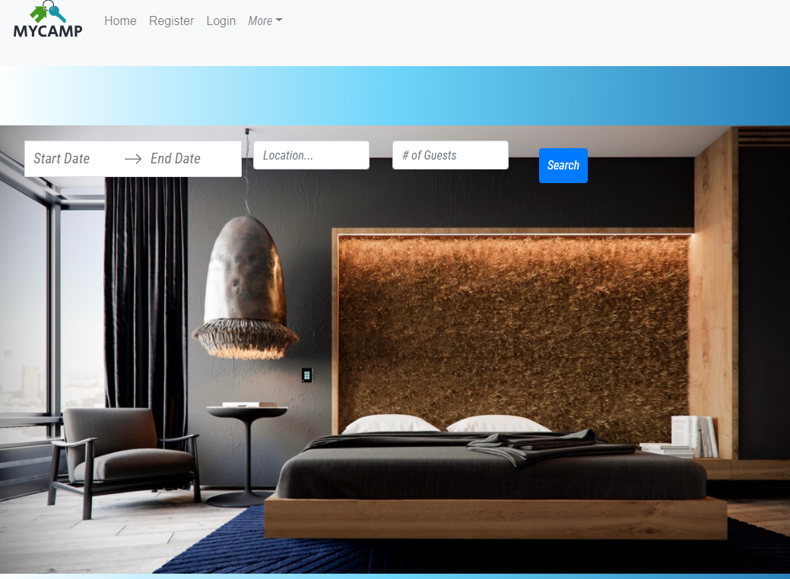

# MyCamp

**MyCamp** is an online rental application where vacationers may search and book vacation rentals, homes, and hotels. The application also has a feature where hosts may opt to host their own homes as a vacation spot.

## Prerequisites

Utilizes MERN stack implementation which is based on Javascript/Node as fullstack web development and requires the latest version of MongoDB Express React and Node.

Additional prerequisites:

* Register for API keys from api service 
* Port set up for MongoDB & Server

## Installation

To install MyCamp follow these steps:

#### Clone/install

npm install in root of application

```
$ git clone git@github.com:VictoriaArda/MyCamp.git
$ npm install
```
## Project Structure

```
client/
   package.json
server
package.json
```

## Dependencies

| Server-Side   
| ------------- 
|   @babel/runtime: ^7.0.0
|   axios: ^0.19.2
|   bcrypt: ^5.0.0
|   bootstrap: ^4.5.0
|   create-react-context: ^0.3.0
|   dom: 0.0.3
|   express: ^4.16.3
|   firebase: ^7.17.1
|   if-env: ^1.0.4
|   material-components-web: ^7.0.0
|   mdbreact: ^4.27.0
|   mdreact: ^0.1.5
|   moment: ^2.19.3 
|   mongoose: ^5.9.27
|   request: ^2.88.2
|   body-parser: ^1.19.0
|   express-session: ^1.17.1
|   passport: ^0.4.1
|   passport-local: ^1.0.0
|   path: ^0.12.7 


| Client-Side  
| ------------- 
|   mdbreact: ^4.27.0
|   re: ^0.1.4
|   react: ^16.13.1
|   react-bootstrap: ^1.3.0
|   react-bootstrap-carousel: ^4.0.6
|   react-dates: ^21.8.0
|   react-dom: ^16.13.1
|   react-router-dom: ^5.2.0
|   react-scripts: ^2.1.1


## Usage
To use MyCamp follow these steps:

#### Start app
```
npm start
```
#### Optional seeds for testing DB
```
npm run seed
```

## Preview



[Deployment Link](https://mycamp2020.herokuapp.com/)

## Contributors

Thanks to the following people who have contributed to this project:

* Victoria Arda
* Sarita Das
* Jaime Bennett
* Nancy Cruz
* Jairo Martinez
* Vlada Antonchenko
